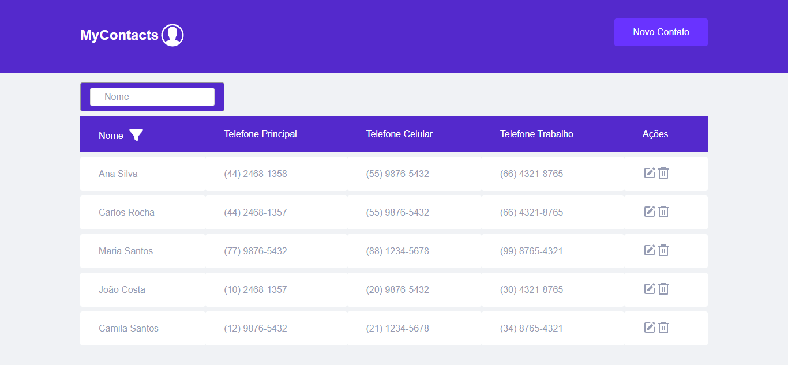
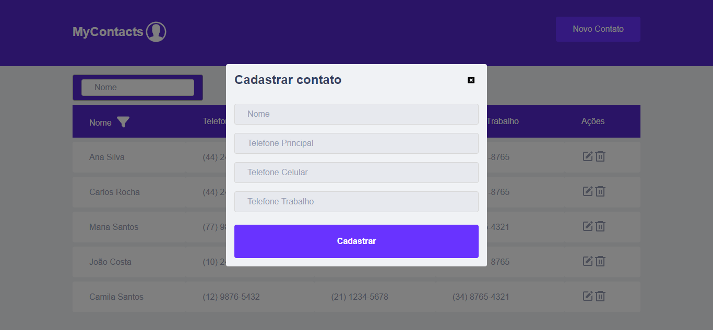

<h1 align="center">
  
</h1>

  

 

## 🚀 Tecnologias, Hooks e Bibliotecas

Projeto desenvolvido com as seguintes tecnologias:

- ReactJS
- TypeScript
- useState (hook que armazena dados que podem variar com o tempo, qualquer informação ou dado deve ser armazenado no useState, só assim será possível renderizar a informação para o frontend web ou mobile)
- useEfect (hook utilizado para controlar a execução de uma função a partir da alteração de um determinado parâmetro)
- Context API (compartilhamento de estado entre vários componentes da aplicação, utiliza o hook useContext())
- Styled Components (biblioteca que permite escrever códigos CSS dentro do Javascript)
- React-toastify - (biblioteca que realiza notificações da aplicações)
- Vitest - (Vitest é uma estrutura de teste unitário JavaScript )
- Yup - (Yup é uma biblioteca JavaScript de validação de esquema para valores.)
- Axios (biblioteca usada no lugar de fetch(), que passa a não precisarmos repetir a digitação do endereço do servidor em cada requisição, informando apenas a rota e seus parâmetros, e também passamos a poder interceptar requisições e respostas pra nossa API antes de chegar no back-end para realizar alguma regra, por exemplo enviar algum token de autenticação)
- React Modal (biblioteca que renderiza o conteúdo de seu filho sobre um componente backdrop e fornece muitos recursos relacionados a interação destes dois)

## 💻 O desafio

Através da utilização de princípios de Clean Code, SOLID e da aplicação de Design Patterns, seu desafio será desenvolver uma lista de contatos (parecida com as que vêm nos celulares por padrão).Deve ter os seguintes campos: (Nome, telefone princial, telefone celular, telefone trabalho) com isso agenda deve atender aos seguintes requisitos:
Funcionalidades
➭ CRUD de contatos
➭ Agrupamento dos contatos (por categorias ou pelas iniciais do nome)
➭ Busca de contatos com sugestão de pesquisa
➭ Validação dos formulários no frontend

Requisitos técnicos
➭ Utilizar ReactJS com Typescript
➭ Criar os componentes do zero (é permitido utilizar bibliotecas para dar suporte apenas para a parte visual, ou seja, apenas o CSS e não o componente em si)
➭ Sugestões de pacotes: vitejs, react-modal, react-hook-form, yup, json-server

Sendo um desafio em Front-End, recomendamos utilizar o pacote json-server para simular uma API. Você pode também optar por desenvolver uma API simples para receber esses cadastros ou mantê-los em algum armazenamento Front-End a seu critério. A utilização do ReactJS e Typescript no desenvolvimento da agenda é obrigatória.
Como um extra, seria legal que exibisse ou importasse contatos de determinada API de algum sistema WEB qualquer (VExpenses, ContaAzul, Contatos Google ou qualquer outro que prefira) e também utilizasse a Context API ou Redux para gerenciamento de estado da aplicação.

## 🔖 Como rodar instalar JSON server (Banco de dados local)

Pré-requisitos:

Certifique-se de ter o Node.js instalado em seu sistema. Você pode baixá-lo e instalá-lo a partir do site oficial: Node.js.

Instalação global do JSON Server:

Abra seu terminal ou prompt de comando.
Execute o seguinte comando para instalar o JSON Server globalmente usando o npm (Node Package Manager):

npm install -g json-server

Iniciando o Servidor JSON

No terminal, navegue até o diretório onde está localizado o arquivo db.json.
Execute o seguinte comando para iniciar o servidor JSON, apontando para o seu arquivo db.json:

json-server --watch db.json

## 🔖 Como rodar a aplicação

Executando o Vite:

No terminal, execute o seguinte comando para iniciar o servidor de desenvolvimento do Vite:

npm run dev

Por Rodrigo César
